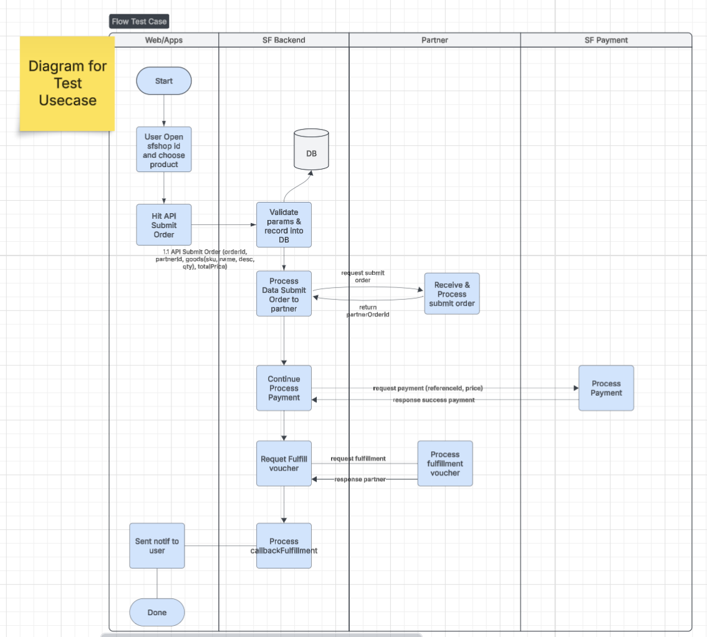
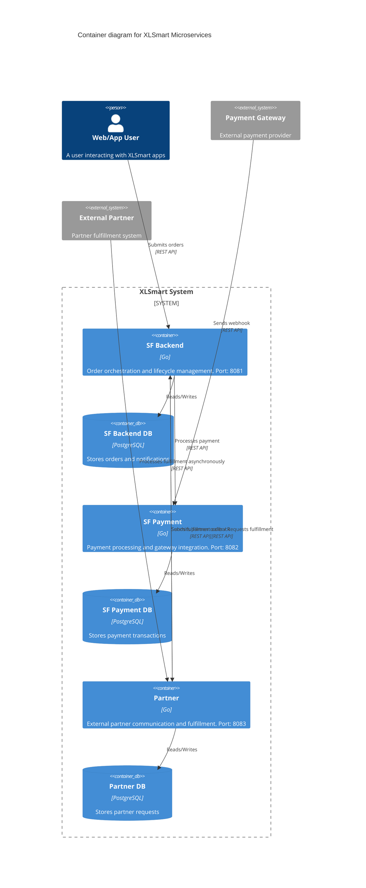
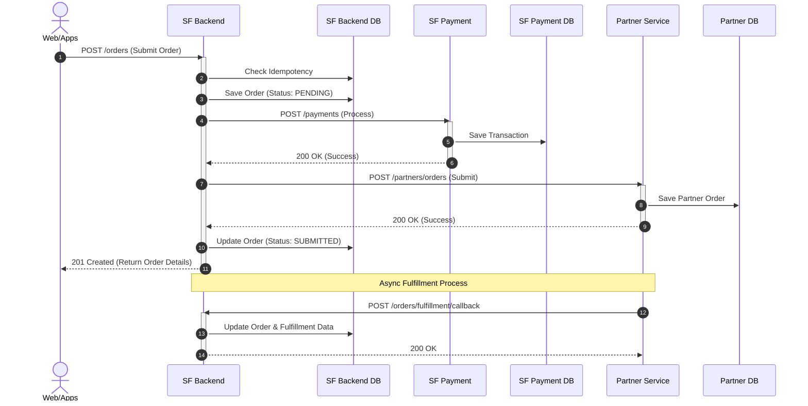
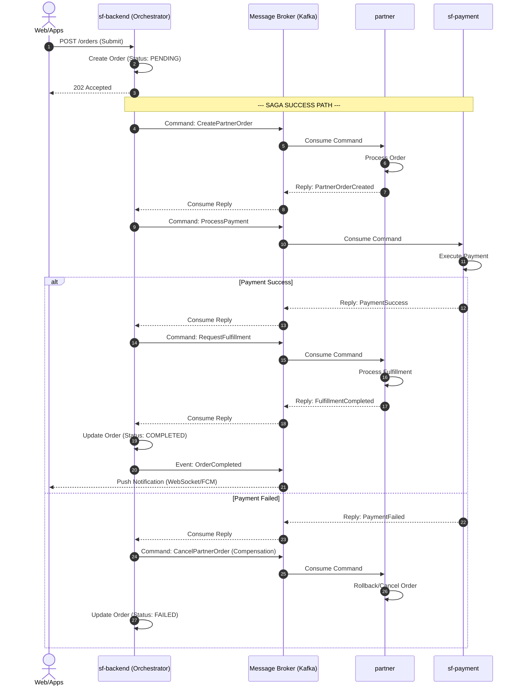

# XLSmart API - Microservices Architecture

Production-ready microservices architecture with 3 independent services and separate databases.

## 🏗️ Architecture Overview
test case





---

## 🚀 How to Run

### Prerequisites
- **Docker** & **Docker Compose**
- Postman (for testing API)

### Step-by-Step Guide (Docker)

1. **Clone and Setup**
   Make sure you are in the project root directory where `docker-compose.microservices.yml` is located.

2. **Run All Services**
   Execute the following command to start the databases and microservices:
   ```bash
   docker compose -f docker-compose.microservices.yml up -d --build
   ```

3. **Verify Status**
   Check if all 6 containers (3 Databases, 3 Services) are running successfully:
   ```bash
   docker ps
   ```

4. **View Logs (Optional)**
   If you want to see the real-time logs of the microservices:
   ```bash
   docker compose -f docker-compose.microservices.yml logs -f
   ```

5. **Stop Services**
   To turn off all services:
   ```bash
   docker compose -f docker-compose.microservices.yml down
   ```

---

## 🧪 How to Test (Postman)

A pre-configured Postman Collection is included in the project to make testing easier.

### Importing Postman Collection
1. Open your Postman application.
2. Click **Import** (top left).
3. Select or drag-and-drop the file: `xlsmart-api.postman_collection.json` located in the `api-contract/` folder of this project.
4. You will see a new collection named **"XLSmart Microservices API"**.

### Testing the Endpoints
### Synchronous Workflow Diagram (Current Implementation)

Berikut adalah urutan interaksi antar service yang berjalan saat ini menggunakan Synchronous HTTP Call:



*Note: The Postman collection uses dynamic variables like `{{$guid}}` to automatically generate unique `X-Request-Id` and `Idempotency-Key` for every request.*

---

## 📦 Services Details

### 1. **SF Backend (Order Service)** - Port 8081
**Responsibility**: Order orchestration and lifecycle management
**Database**: `sf_backend_db` (PostgreSQL on port 5432)
**Endpoints**:
- `POST /orders` - Create order
- `POST /orders/fulfillment/callback` - Receive fulfillment callback
- `POST /internal/notifications` - Trigger notifications

### 2. **SF Payment (Payment Service)** - Port 8082
**Responsibility**: Payment processing and gateway integration
**Database**: `sf_payment_db` (PostgreSQL on port 5433)
**Endpoints**:
- `POST /payments` - Process payment
- `POST /payments/webhook` - Handle payment gateway webhook

### 3. **Partner (Integration Service)** - Port 8083
**Responsibility**: External partner communication
**Database**: `partner_db` (PostgreSQL on port 5434)
**Endpoints**:
- `POST /partners/orders` - Submit order to partner
- `POST /partners/fulfillment` - Request fulfillment

---

## 🔒 Security & Features
- **Data Isolation**: Each service uses its own database (`sf_backend_db`, `sf_payment_db`, `partner_db`).
- **Idempotency**: Implemented `Idempotency-Key` headers on POST endpoints to prevent double processing.
- **Traceability**: Implemented `X-Request-Id` to trace requests across microservices.
- **Signatures**: HMAC signature validation for webhooks and callbacks via `X-Signature`.

---

## 💡 Proposed Solutions for Better Improvement

While the current architecture successfully splits the domains into three independent microservices, the orchestration relies heavily on synchronous HTTP calls. Below are ideas to elevate the architecture to be more robust, scalable, and fault-tolerant.

### 1. Shift to Event-Driven Architecture (EDA) & Saga Pattern
- **Current Flaw:** The `SF Backend` synchronously calls `Partner` and `SF Payment` during the user's request. If the Payment service takes 10 seconds, the user waits 10 seconds. If `Partner` is down, the whole order fails immediately without a chance to recover.
- **Solution:** Implement the **Saga Pattern** using a Message Broker (e.g., Kafka or RabbitMQ). `SF Backend` immediately returns a `202 Accepted` to the user and processes the workflow asynchronously in the background. If a step fails (e.g., Payment fails), the Saga orchestrator will automatically trigger compensating transactions (e.g., Cancel Partner Order).

### 2. Robust Idempotency & Retry Mechanisms
- **Current State:** Basic Idempotency checks are implemented via HTTP headers (`Idempotency-Key`) and a database check.
- **Solution:** Combine this with a robust retry mechanism (Exponential Backoff) and Dead Letter Queues (DLQ) for asynchronous messages. This ensures that transient network failures do not result in lost orders or double payments.

### 3. Circuit Breaking & Rate Limiting
- **Solution:** Implement Circuit Breakers (e.g., using `gobreaker`) on inter-service HTTP clients. If the `Partner Service` starts failing or lagging, the Circuit Breaker trips and prevents cascading failures, returning a fast fallback response instead of hanging and consuming resources.

### 4. Improved Ideal Workflow (Saga Pattern)

Here is how the improved Event-Driven Orchestration (Saga) would look:


