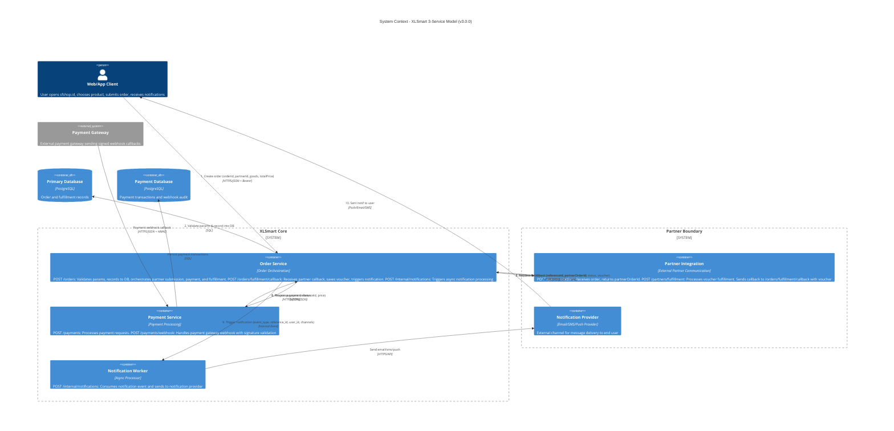

# XLSmart API - C4 Context (3 Service Boundaries)

This document reflects the refactored service boundaries with clean API design:
- **Order Service** (SF Backend)
- **Payment Service** (SF Payment)
- **Partner Integration** (Partner)

Web/App remains an external actor.

## System Context

## Responsibility Split

### Order Service (SF Backend)
- **POST /orders**: Orchestrates order creation flow
  - Validates params & records into DB
  - Submits order to partner
  - Processes payment
  - Requests fulfillment
- **POST /orders/fulfillment/callback**: Receives partner callback
  - Validates signature, replay window, idempotency
  - Saves voucher + updates status
  - Triggers notification
- **POST /internal/notifications**: Internal notification trigger endpoint

### Payment Service (SF Payment)
- **POST /payments**: Processes payment request from Order Service
  - Validates payload, idempotency key
  - Executes payment processing
  - Returns payment status
- **POST /payments/webhook**: Handles payment gateway webhook
  - Verifies HMAC signature, replay window
  - Updates payment status
  - Notifies Order Service of payment result

### Partner Integration (Partner)
- **POST /partners/orders**: Receives & processes order submission
  - Validates payload, idempotency key
  - Creates partnerOrderId
  - Returns partnerOrderId
- **POST /partners/fulfillment**: Processes fulfillment request
  - Validates reference and eligibility
  - Processes voucher fulfillment async
  - Returns FULFILLMENT_IN_PROGRESS
  - Sends callback to Order Service `/orders/fulfillment/callback` when ready

## API Design Principles Applied

### ✅ Clean Naming
- Kebab-case only (`/orders`, `/payments`, `/partners`)
- No verbs in endpoint names (removed `/submit`, `/request`, `/trigger`)
- Domain-first structure (no service prefixes like `/sf-backend`)

### ✅ Clear Service Boundaries
- **Order Service** = orchestration and source of truth
- **Payment Service** = payment processing only
- **Partner Integration** = external communication only
- **Internal Service** = async operations only

### ✅ Explicit Callbacks
- `/webhook` for external payment gateway callbacks
- `/callback` for external partner callbacks
- `/internal` for internal-only endpoints

### ✅ RESTful Design
- `POST /orders` - Create resource
- `GET /orders/{orderId}` - Read resource
- `GET /payments/{referenceId}` - Read resource
- Proper HTTP methods and status codes
