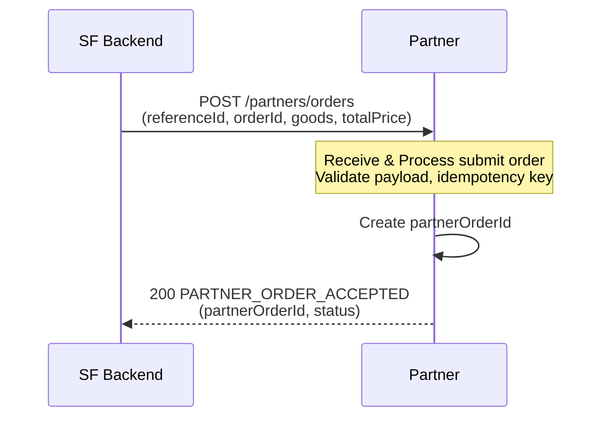
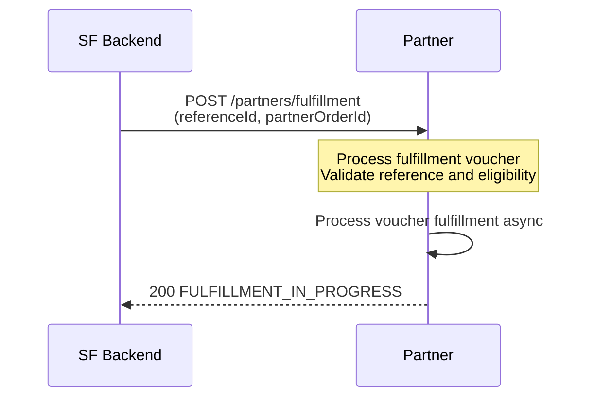
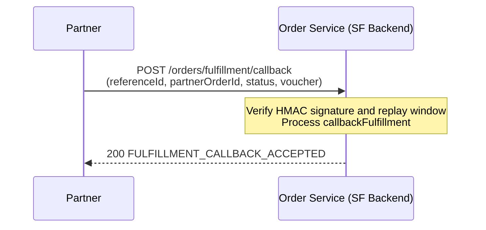

# Partner - Sequence Diagrams (Per Endpoint)

## Endpoint: `POST /partners/orders`

```mermaid
sequenceDiagram
    participant SF as SF Backend
    participant PA as Partner

    SF->>PA: POST /partners/orders<br/>(referenceId, orderId, goods, totalPrice)
    Note over PA: Receive & Process submit order<br/>Validate payload, idempotency key
    PA->>PA: Create partnerOrderId
    PA-->>SF: 200 PARTNER_ORDER_ACCEPTED<br/>(partnerOrderId, status)
```

## Endpoint: `POST /partners/fulfillment`

```mermaid
sequenceDiagram
    participant SF as SF Backend
    participant PA as Partner

    SF->>PA: POST /partners/fulfillment<br/>(referenceId, partnerOrderId)
    Note over PA: Process fulfillment voucher<br/>Validate reference and eligibility
    PA->>PA: Process voucher fulfillment async
    PA-->>SF: 200 FULFILLMENT_IN_PROGRESS
```

## Outbound Callback Contract (Partner → Order Service)

```mermaid
sequenceDiagram
    participant PA as Partner
    participant SF as Order Service (SF Backend)

    PA->>SF: POST /orders/fulfillment/callback<br/>(referenceId, partnerOrderId, status, voucher)
    Note over SF: Verify HMAC signature and replay window<br/>Process callbackFulfillment
    SF-->>PA: 200 FULFILLMENT_CALLBACK_ACCEPTED
```
