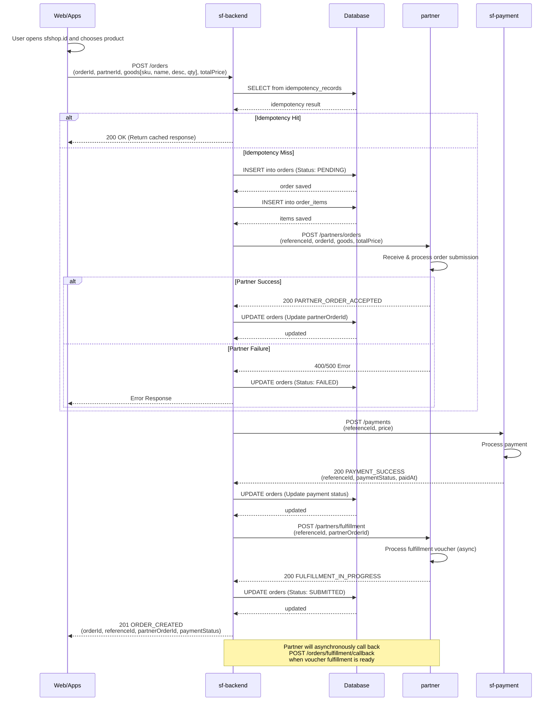
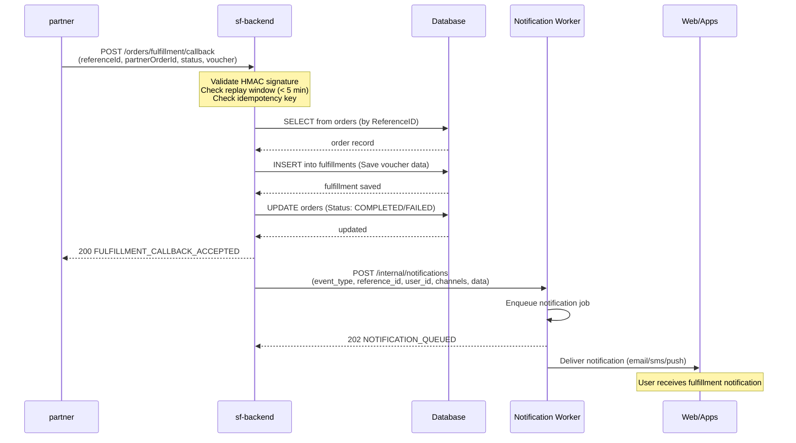
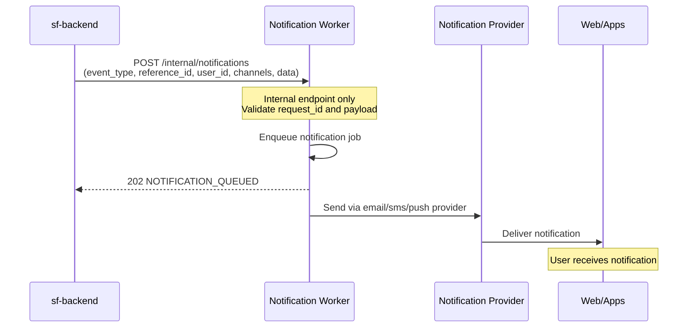

# Order Service - Sequence Diagrams (Per Endpoint)

## Endpoint: `POST /orders`

---

## Endpoint: `POST /orders/fulfillment/callback`

> Called by **Partner Integration** (not by Order Service itself) when fulfillment is complete.

---

## Endpoint: `POST /internal/notifications`

> Internal only — triggered by Order Service after fulfillment callback is processed.

