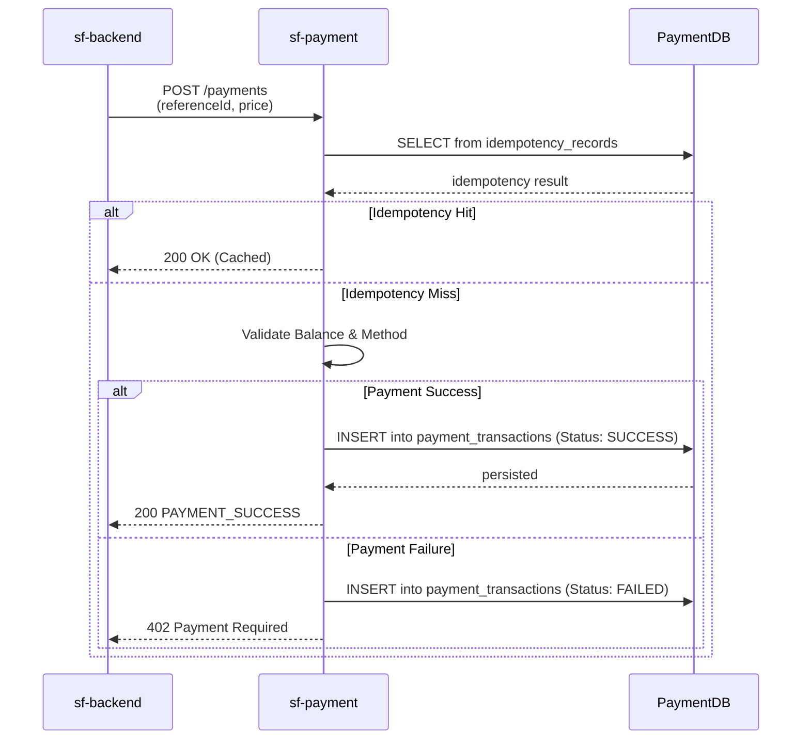
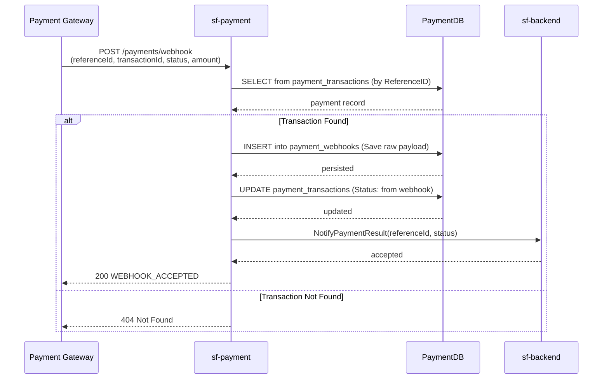

# SF Payment - Sequence Diagrams (Per Endpoint)

## Endpoint: `POST /payments`

```mermaid
sequenceDiagram
    participant Backend as sf-backend
    participant Payment as sf-payment
    participant Database as PaymentDB

    Backend->>Payment: POST /payments<br/>(referenceId, price)
    Payment->>Database: SELECT from idempotency_records
    Database-->>Payment: idempotency result
    
    alt Idempotency Hit
        Payment-->>Backend: 200 OK (Cached)
    else Idempotency Miss
        Payment->>Payment: Validate Balance & Method
        alt Payment Success
            Payment->>Database: INSERT into payment_transactions (Status: SUCCESS)
            Database-->>Payment: persisted
            Payment-->>Backend: 200 PAYMENT_SUCCESS
        else Payment Failure
            Payment->>Database: INSERT into payment_transactions (Status: FAILED)
            Payment-->>Backend: 402 Payment Required
        end
    end
```

## Endpoint: `POST /payments/webhook`

```mermaid
sequenceDiagram
    participant Gateway as Payment Gateway
    participant Payment as sf-payment
    participant Database as PaymentDB
    participant Backend as sf-backend

    Gateway->>Payment: POST /payments/webhook<br/>(referenceId, transactionId, status, amount)
    Payment->>Database: SELECT from payment_transactions (by ReferenceID)
    Database-->>Payment: payment record
    
    alt Transaction Found
        Payment->>Database: INSERT into payment_webhooks (Save raw payload)
        Database-->>Payment: persisted
        Payment->>Database: UPDATE payment_transactions (Status: from webhook)
        Database-->>Payment: updated
        Payment->>Backend: NotifyPaymentResult(referenceId, status)
        Backend-->>Payment: accepted
        Payment-->>Gateway: 200 WEBHOOK_ACCEPTED
    else Transaction Not Found
        Payment-->>Gateway: 404 Not Found
    end
```
